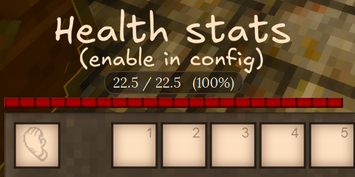
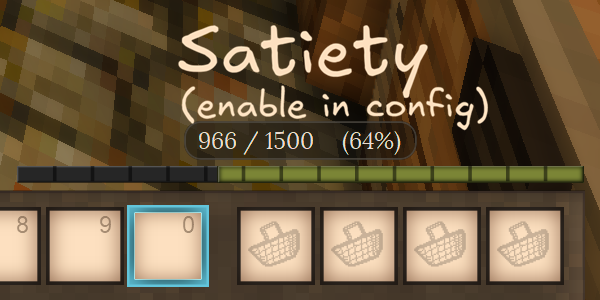
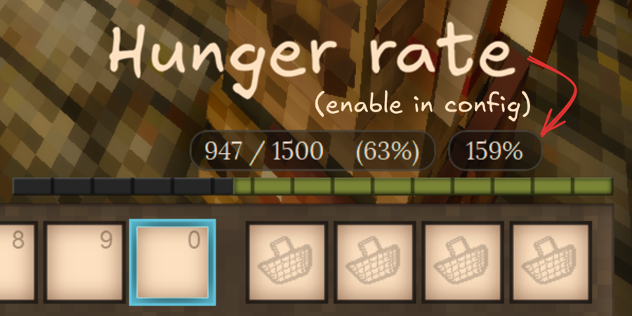
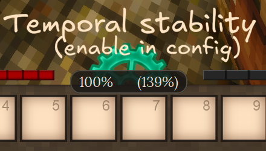
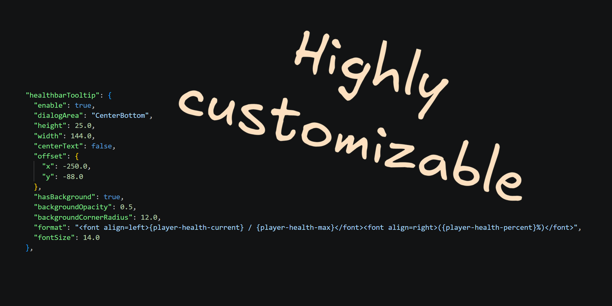
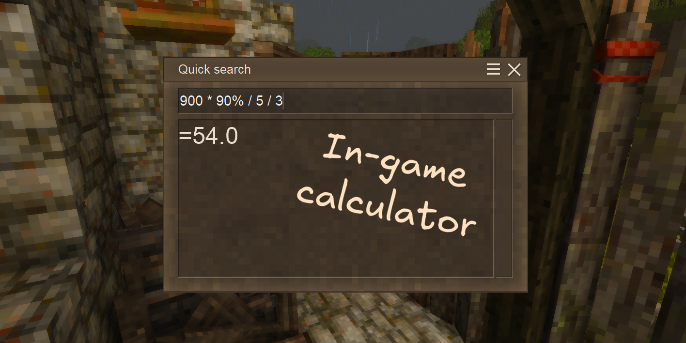

# Overview

UI Tweaks is a mod for Vintage Story that enhances the user interface by adding various quality-of-life features and visual improvements. The mod aims to provide a more intuitive and customizable UI experience for players, making it easier to navigate and interact with the game.

  

    

      &#10094;
    

    

      

        
      

      

        
      

      

        
      

      

        
      

      

        
      

      

        
      

      

        
      

      

        
      

    

    

      &#10095;
    

  

  

    
    
    
    
    
    
    
    
  

You can install UI Tweaks from the official mod repository or directly from GitHub. Check out the [Installation](04.installation.md) section for detailed instructions on how to get started.

Make sure to check out the [Features](02.features.md) section to see all the cool things UI Tweaks has to offer!