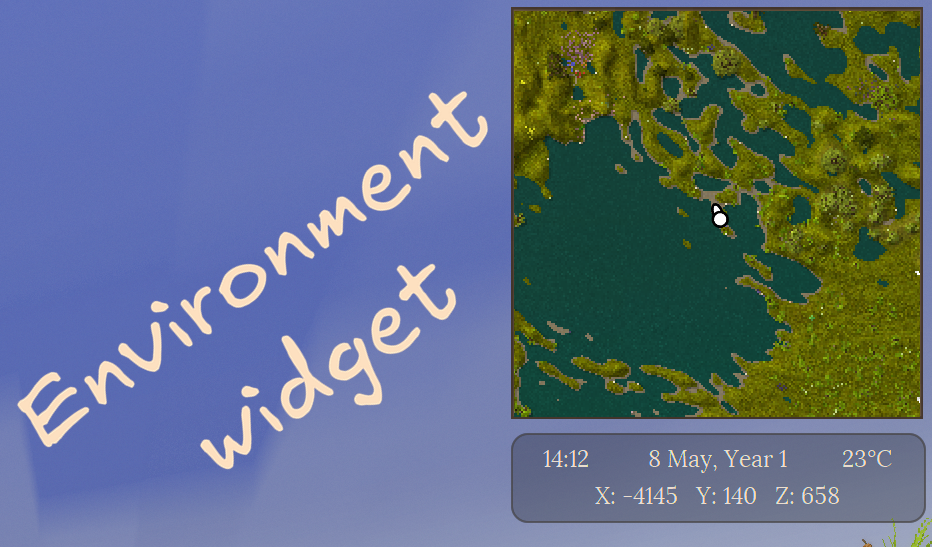
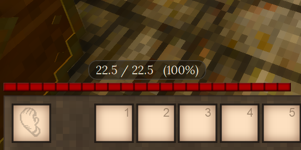
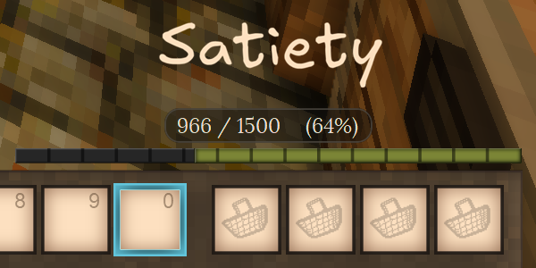
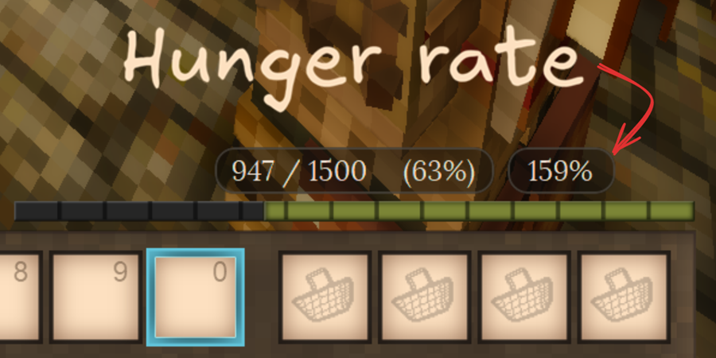
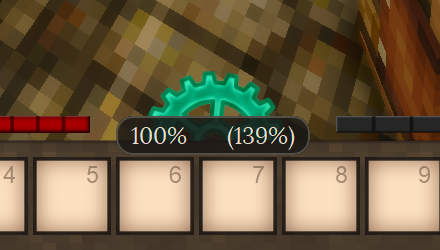
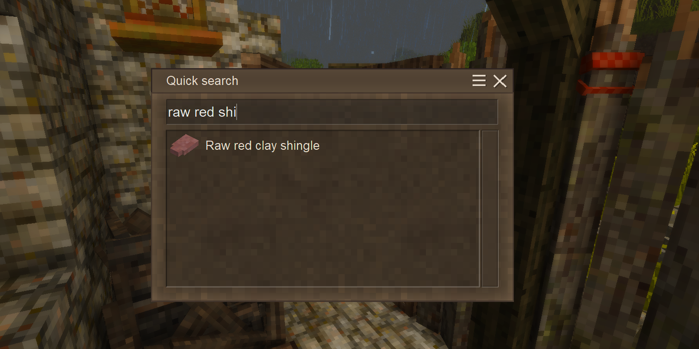
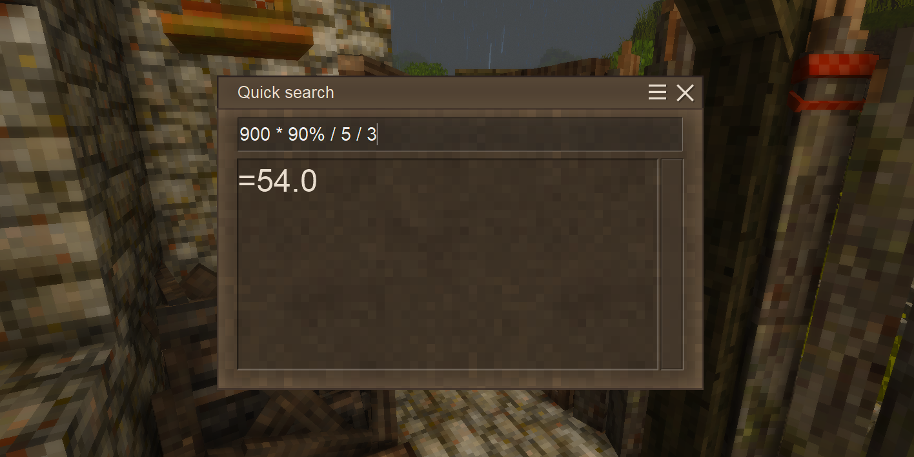

# Features

## Status Tooltips

> 💡 Inspired by [Extended HUD info](https://mods.vintagestory.at/extendedhudinfo/).

Customize your HUD by enabling additional elements provided by UI Tweaks:

- **HP**: Displays current / maximum HP as a number or a percentage above the health bar.
- **Satiety**: Displays current / maximum satiety as a number or a percentage above the satiety bar.
- **Hunger rate**: Displays the player's current hunger rate.
- **Temporal stability**: Displays the player's temporal stability, as well as temporal stability at player's current position.

  

    

      &#10094;
    

    

      

        
      

      

        
      

      

        
      

      

        
      

      

        
      

    

    

      &#10095;
    

  

  

    
    
    
    
    
  

## Quick Search

> 💡 Inspired by [Satisfactory's](https://www.satisfactorygame.com/) quick search feature.

QuickSearch allows quickly searching for handbook entries by name. Simply press the configured hotkey (default: `N`) and start typing the name of the entry you want to find.

This search behaves differently from the vanilla handbook search. We hope you find it intuitive and easy to use. Try it out and let us know what you think!

Also check out the [Calculator](#calculator) feature below, which allows Quick Search to double as a simple calculator.

  

**We think Quick Search may benefit from the following features in the future:**

- Search filters
- Search guide entries
- Search by description
- Search by item tags

## Calculator

[QuickSearch](#quick-search) also allows calculating mathematical expressions right in the search box, just like in [Satisfactory](https://www.satisfactorygame.com/)!

  

Supported operations:
- Addition: `+`
- Subtraction: `-`
- Multiplication: `*`
- Division: `/`
- Percentages: `%`
- Parentheses: `()`
- More operations may be added in the future!

## Request a Feature

If you have an idea for a feature you'd like to see in UI Tweaks, please let us know! You can submit a feature request as an [issue](https://github.com/BitzArt-VS/UI-Tweaks/issues) on our [GitHub repository](https://github.com/BitzArt-VS/UI-Tweaks) or reach out to us on our [Discord server](https://discord.gg/eZUFCVWWtK). We welcome all suggestions and will do our best to consider them for future updates!